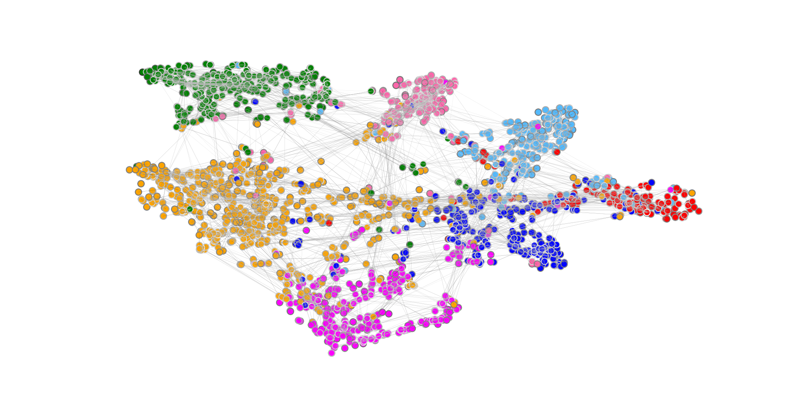

## Introduction
Reproduction of [Graph Attention Networks, Veličković et. al. 2017](https://arxiv.org/pdf/1710.10903) paper, inspired by [Aleksa Gordić's repository](https://github.com/gordicaleksa/pytorch-GAT). GAT implementation was verified against CORA (for transductive tasks) and PPI (for inductive tasks), and in both cases reported results were achieved, ~82% accuracy on CORA and ~0.937 micro-averaged F1 on PPI.

## Table of content
* [CORA training](#cora-training)
* [CORA visualization](#cora-visualization)
* [PPI training](#ppi-training)

## Cora training
I used the preprocessed version of CORA, which can be found [here](https://github.com/gordicaleksa/pytorch-GAT/tree/main/data/cora). Preprocessing was done by [Aleksa Gordić](https://github.com/gordicaleksa), so credits to him once again. Aforementioned CORA datasets is included in this repository as well, because it is very small, consists of 3 pickle dumps. Both training scripts have Tensorboard support. Additionally, I also reproduced graph embedding visualization, Figure 2 from the original paper, you can see then in the next section.

To train a GAT on CORA, you can use **train_cora.py**:
```
usage: train_cora.py [-h] --attention_heads_per_layer ATTENTION_HEADS_PER_LAYER [ATTENTION_HEADS_PER_LAYER ...] --num_features_per_layer NUM_FEATURES_PER_LAYER [NUM_FEATURES_PER_LAYER ...]
                     [--residual [RESIDUAL]] [--dropout_p DROPOUT_P] [--from_checkpoint [FROM_CHECKPOINT]] [--learning_rate LEARNING_RATE] [--weight_decay WEIGHT_DECAY] [--random_seed RANDOM_SEED]        
                     [--log_every LOG_EVERY] [--checkpoint_period CHECKPOINT_PERIOD]
                     data_dir model_dir epochs

positional arguments:
  data_dir              Directory that contains the CORA dataset.
  model_dir             Directory where the model will be saved.
  epochs                Number of training epochs

options:
  -h, --help            show this help message and exit
  --attention_heads_per_layer ATTENTION_HEADS_PER_LAYER [ATTENTION_HEADS_PER_LAYER ...]
                        List of numbers of attention heads per GAT layer.
  --num_features_per_layer NUM_FEATURES_PER_LAYER [NUM_FEATURES_PER_LAYER ...]
                        List of number of features per GAT layer. Output number of features for a particular layer is num_output_features * num_attention_heads
  --residual [RESIDUAL]
                        Specify if the network should use residual connections. Defaults to False
  --dropout_p DROPOUT_P
                        Specify dropout probability. Dropout is applied to the input of GAT layers as well as on per-edge attention scores.
  --from_checkpoint [FROM_CHECKPOINT]
                        Specify if you wish to continue training from a checkpoint in model_dir.
  --learning_rate LEARNING_RATE
                        Specify learning rate.
  --weight_decay WEIGHT_DECAY
                        Specify amount of applied weight decay.
  --random_seed RANDOM_SEED
                        Specify reproducibility seed.
  --log_every LOG_EVERY
                        Specify logging frequency.
  --checkpoint_period CHECKPOINT_PERIOD
                        Specify checkpointing period.
```

When specyfing number of features for the last layer, it is important to take the properties of the dataset into consideration. For instance, CORA embeddings should be 7-dimensional, because they are used as logits for 7-class classification problem. Likewise, PPI embeddings should be 121-dimensional, because it is a 121 multi-label classification problem. Concatenation is used to aggregate attention results in all but the last layer, in which mean reduction is used, as specified by the authors of the paper.

CORA model achieves reported $\approx 82$% accuracy on CORA test set after only 1000 epochs, with the following hyperparameters (same ones were used in the paper):
```
--attention_heads_per_layer 8 1
--num_features_per_layer 8 7
--dropout_p 0.6
--learning_rate 0.005
--weight_decay 0.0005
```
## Cora visualization
Once a GAT is trained on CORA, you can visualize node embeddings with **visualization_cora.py**:
```
usage: visualization_cora.py [-h] [--tsne_perplexity TSNE_PERPLEXITY] [--marker_size MARKER_SIZE] [--attention_layer_index ATTENTION_LAYER_INDEX] data_dir model_dir

positional arguments:
  data_dir              Path to the CORA dataset.
  model_dir             Path to the directory which contains CORA GAT checkpoint.

options:
  -h, --help            show this help message and exit
  --tsne_perplexity TSNE_PERPLEXITY
                        Specify perplexity to be used by t-SNE. Perplexity is related to the number of nearest neighbors in the input embedding space.
  --marker_size MARKER_SIZE
                        Specify area of a single point on the graph embedding plot.
  --attention_layer_index ATTENTION_LAYER_INDEX
                        Specify the index of GAT layer for which attention coefficients will be taken for edge visualization.
```

As the original GAT paper, we use [t-SNE](https://en.wikipedia.org/wiki/T-distributed_stochastic_neighbor_embedding) on pre-trained node embeddings to reduce them to 2 dimensions. Example of pre-trained CORA embeddings generated by previous command, after training for 10000 epochs:


Edge thicnkess coressponds to attention coefficients in the given layer. Thicker edge arround nodes corresponds to higher self-attention in the given layer. From here, we can observe that for the most part, nodes of the same class tend to cluster together. In particular, labels for cora are: **Case Based, Genetic algorithms, Neural networks, Probabilistic methods, Reinforcement learning, Rule learning theory**. However ,for [this](https://github.com/gordicaleksa/pytorch-GAT/tree/main/data) particular instance of the Cora dataset I was not able to find correct class id to class label mapping. Also, this is viewed as a single label classification problem, but we can see that previous labels are highly correlated (for example, a paper about reinforcement learning is very likely to use some kind of neural network), which could explain why the previus plot is not perfectly clustered.

Training with described hyperparameters was really fast, using one NVIDIA GTX 3060, 10000 epochs was conducted in $\approx$ 1 minute.

## PPI training
Preprocessed version of PPI - Protein/Protein Interaction dataset can be found [here](https://data.dgl.ai/dataset/ppi.zip). I haven't been able to find more information about this dataset, number of node features is 50 and it represents a 121 multi-label classification problem. There are 20 train graphs, 2 validation graphs and 2 testing graphs, with the average number of nodes in each graph being 2372. PPI is significantlly larger than CORA and it wasn't able to fit into entire GPU, so batches are moved to GPU on-demand. Options for **train_ppi.py** script:
```
usage: train_ppi.py [-h] --attention_heads_per_layer ATTENTION_HEADS_PER_LAYER [ATTENTION_HEADS_PER_LAYER ...] --num_features_per_layer NUM_FEATURES_PER_LAYER [NUM_FEATURES_PER_LAYER ...] [--residual [RESIDUAL]]
                    [--dropout_p DROPOUT_P] [--from_checkpoint [FROM_CHECKPOINT]] [--learning_rate LEARNING_RATE] [--weight_decay WEIGHT_DECAY] [--random_seed RANDOM_SEED] [--log_every LOG_EVERY]
                    [--checkpoint_period CHECKPOINT_PERIOD] [--batch_size BATCH_SIZE]
                    data_dir model_dir epochs

positional arguments:
  data_dir              Directory that contains the CORA dataset.
  model_dir             Directory where the model will be saved.
  epochs                Number of training epochs

options:
  -h, --help            show this help message and exit
  --attention_heads_per_layer ATTENTION_HEADS_PER_LAYER [ATTENTION_HEADS_PER_LAYER ...]
                        List of numbers of attention heads per GAT layer.
  --num_features_per_layer NUM_FEATURES_PER_LAYER [NUM_FEATURES_PER_LAYER ...]
                        List of number of features per GAT layer. Output number of features for a particular layer is num_output_features * num_attention_heads
  --residual [RESIDUAL]
                        Specify if the network should use residual connections. Defaults to False
  --dropout_p DROPOUT_P
                        Specify dropout probability. Dropout is applied to the input of GAT layers as well as on per-edge attention scores.
  --from_checkpoint [FROM_CHECKPOINT]
                        Specify if you wish to continue training from a checkpoint in model_dir.
  --learning_rate LEARNING_RATE
                        Specify learning rate.
  --weight_decay WEIGHT_DECAY
                        Specify amount of applied weight decay.
  --random_seed RANDOM_SEED
                        Specify reproducibility seed.
  --log_every LOG_EVERY
                        Specify logging frequency.
  --checkpoint_period CHECKPOINT_PERIOD
                        Specify checkpointing period.
  --batch_size BATCH_SIZE
                        Specify the batch size for training. Batch size for inductive GNN training determines number of graphs that are simultaneously forwarded through the network.
```

After training for 200 epochs on NVIDIA RTX 3060, which took around 8 minutes, reported micro-averaged $F_1$ of 0.97 was achieved, with the following hyperparameters (also mentioned in the paper):
```
--attention_heads_per_layer 4 4 6 
--num_features_per_layer 256 256 121 
--dropout_p 0 
--learning_rate 0.005
--weight_decay 0
--batch_size 2
--residual # PPI is deeper and requires residual pathways for stable training
```