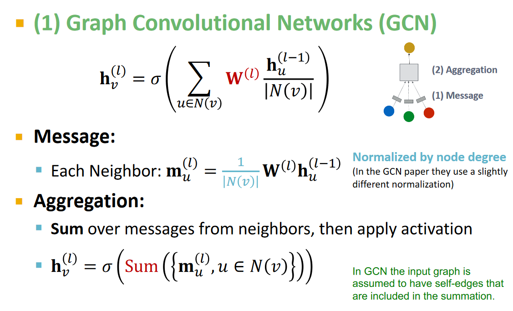
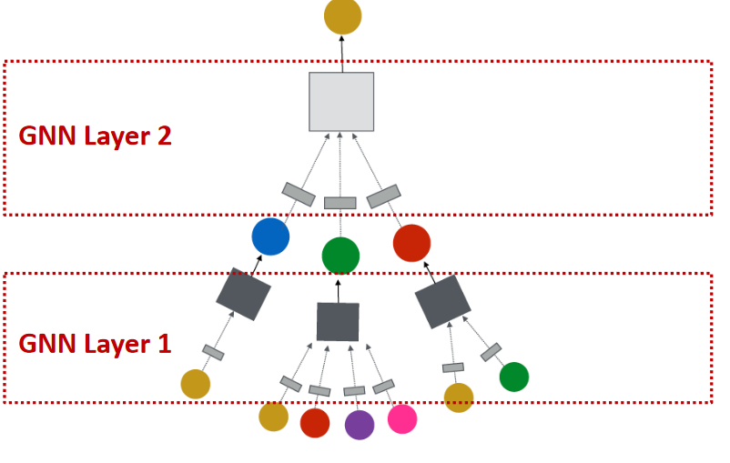
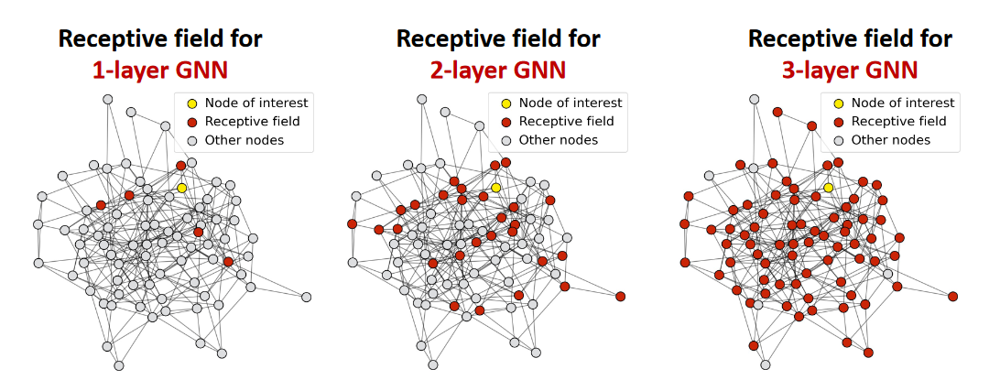
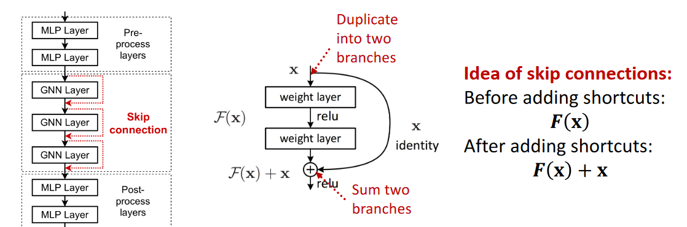
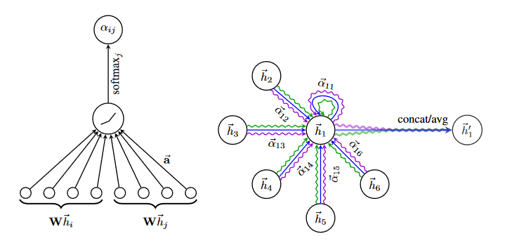

Credits to [Stanford: Machine Learning with Graphs course](https://web.stanford.edu/class/cs224w/), which was used for education on this matter.

## GNN - Graph Neural Networks
An arbitrary graph $G = (V, E)$ does not have a canonnical ordering of nodes. If we view images as graphs for example, cannonical in this context would be traversing the image
starting from the top left pixel. Typical setup is learning a function $f$ which maps all vertices of the graph $G$ into a $d$-dimensional space. From these embeddings, different tasks can be solved:

* Node classification/regression - takes as input single node embedding
* Link prediction - takes as input two node embeddings
* Community detection - clustering over learned node embeddings
* Network similarity - Compute similarity between two sub-graphs based on their node embeddings

In order to solve these problems, we must design a function $f$ that is **permutation equivariant** with respect to the ordering of nodes of $G$. More formally, if $X \in \mathbb{R}^{|V| \times m}$ is the node feature matrix, $A \in \mathbb{R}^{|V| \times |V|}$ is the adjacency matrix of $G$, then we say that $f: \mathbb{R}^{|V| \times m} \times \mathbb{R}^{|V| \times |V|} \rightarrow \mathbb{R}^{|V| \times d}$ is **permutation equivariant** if for any permutation matrix $P$ the following equation holds:

$$
Pf(X, A) = f(PX, PAP^T)
$$

Similarly, there is a concept of **permutation invariance**, but it is relevant when talking about entire graph embeddings, we will stick to generating node embeddings for now. 

## GC - Graph Convolution
The idea is to generalize convolution operator (or cross-convolution operator if you prefer) we're already familiar with for graphical data to arbitrary networks. If $W^l \in \mathbb{R}^{n(l) \times n(l - 1)}$, and $N(v)$ is the neighborhood of node $v$ (including $v$ itself - we include loops loops in the graph most of the time), then output of $l$-th GC - graph convolution layer is for node $v$ is:

$$
h_{v}^{l} = \sigma(\sum_{j \in N(v)} \frac{1}{N(v)} W^lh^{l - 1}_{j})
$$

$n(l)$ represents number of features for learned embeddings at layer $l$, and $\sigma$ is a nonlinearity of choice which is applied element-wise to output vector. Obviously, this is permutation equivariant transformation, because regardless of the chosen node ordering, every $h^{l}_v$ shares the same weight matrix - parameter sharing same as with classical convolutional neural networks. Previous transformation could include a sequence of transformations, not just applying a shared weight matrix - could be an arbitrarily deep MLP. As long as there is weight sharing, permutation equivariance is preserved.

Both graph convolutional layers and graph attention layers (which we cover in the next section) share the same paradigm: each node computes a message, and after that every node produces it's embedding by aggregating messages from it's neighbors.

Another intereseting property of graph neural networks is **the receptive field** of an arbitrary node, it is defined as the set of nodes which affect the final embedding for a given node. In a graph neural network with $K$ layers, each node has a receptive field equal to it's K-hop neighborhood! This is fairly obvious, we omit the proof and add following figures:

It has been observed that deep graph neural networks suffer from the **over-smoothing** problem, which roughly speaking translates to all embeddings converging to the same vector. This can be seen as a consequence of previous observation, as increasing the depth increases the receptive field, and therefore nodes hive a higher overlap in their receptive fields as network depth is increased. One mechanism that alleviates over-smoothing are **skip connections**. Idea is the same as with the original ResNet, explicitly include input of a layer to the output of the layer via addition. This also helps with vanishing gradients, that pretty much all deep networks suffer from.

## GA - Graph Attention
From the graph convolution equation, we can see that each neighboor of a particular node is weighed equally. One possibility to increase the expressiveness of graph convolutions is to let nodes determine the importance of their neighboors automatically, and this can be achieved by including an attention mechanism, similar to RNNs and Transformers. This gives rise to another type of GNN layer - Graph Attention Layer. Let $h_{i}^{l}$ represent noed embeddings at $l$-th layer, obtained in the same way as with graph convolution. We compute the unnormalized attention score between node pair $(i, j)$ where $j \in N(i)$ with a 1 layer MLP:

$$
e_{ij} = leakyReLU(A^{l}(W^lh_{i}^{l - 1} || W^lh_{j}^{l - 1}))
$$

where $A^{l} \in \mathbb{R}^{1 \times 2d}$. Note that $e_{ij} \neq e_{ji}$ in general, and that we generally include loops as well similar to graph convolution. $||$ is of course the concatenation operator. To compute normalized attention scores for node $i$ we perform a softmax over all neighbooring unnormalized attention scores:

$$
\alpha_{ij} = softmax(\{ e_{ij} \mid j \in N(i)\})
$$
 
Finally, we use these to produce the final node embedding:

$$
h_{i}^{l} = \sigma(\sum_{j \in N(i)} \alpha_{ij} W^l h_{j}^{l - 1})
$$

Attention mechanism can be further generalized by introducing multiple attention heads for a single layer - also similar to attention implemented in RNNs and Transformers. With $K$ attention heads, we have the following:

$$
\begin{align}
& e_{ijk} = \rho(A^{lk}(W^lh_{i}^{l - 1} \mid \mid W^{lk}h_{j}^{l - 1})) \\
& \alpha_{ijk} = \frac{\exp(e_{ijk})}{\sum_{t \in N(i)} \exp(e_{itk})} \\
& h_{i}^{lk} = \sum_{j \in N(i)} \alpha_{ijk}W^{lk}h_{j}^{l - 1} \\
& h_{i}^{l} = \sigma(\mid \mid_{s=1}^{K}h_{i}^{ls}) \\
\end{align}
$$

Index $k$ in previous equation denotes a particular weight for $k$-th attention head. $\rho$ can be another nonlinearity of choice, authors of original GAT paper chose LeakyReLU for example. We can see that final embeddings are obtained by concatenating embeddings accross all attention heads, which produces an output of dimension $K \times n(l)$. This can be inconvenient for the last layer, as it needs to have a particular size for the task at hand whil still allowing for multiple attention heads, so what happens in last layer is usually mean aggregation:

$$
h_{i}^{L} = \sigma(\frac{1}{K_{L}} \sum_{s=1}^{K_L}h_{i}^{Ls})
$$

and in this case embeddings of the last layer are $n(L)$ dimensional. Figure from the original GAT paper, which visualizes inner workings of graph attention:

## Sparse matrix representation notes
**COO (Coordinate list)** format: Representing sparse adjacency matrix as a $(2, E)$ matrix $C$, where for each edge $C[0][i]$ is the source vertex and $C[0][j]$ is the destination vertex. Can be extended easily to any real matrix, although 3 vectors would be needed in that case to keep values themselves.

**CSR (Compressed sparse row)** format: Encodes a sparse matrix with 3 one dimensional arrays, $V, C, R$. V holds values for non-zero elements, $C$ holds column indices for non zero elements, and $R[i]$ indicates the number of non-zero elements above row $i$. Last element of $R$ is equal to the total number of non-zero elements of the matrix. Convenient, especially if matrix-vector multiplication operation is common, can be efficiently implemented using this format [link](https://www.netlib.org/utk/people/JackDongarra/etemplates/node382.html).

**LIL (List of Lists)** format: One list per row, elements of lists are tuples (column_index, value). Adjacency list is a form of LIL.